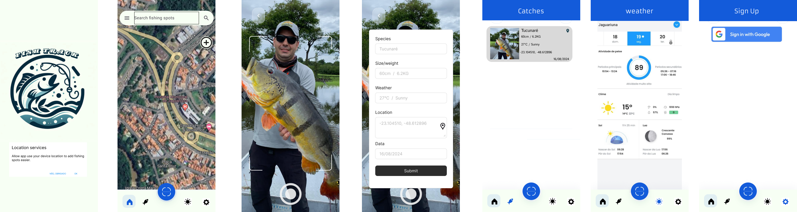

# Fish Track

Fish Track é o aplicativo ideal para os amantes da pesca que desejam registrar e acompanhar suas capturas de forma prática e organizada. Com o Fish Track, você pode facilmente tirar fotos dos peixes que capturou e registrar detalhes importantes como a data, peso, tamanho e local da pesca.

Além de ser uma ferramenta útil para manter um histórico completo das suas capturas, o Fish Track permite que você compartilhe suas conquistas com amigos e outros pescadores, tornando a experiência de pesca ainda mais divertida e social. O aplicativo é intuitivo e fácil de usar, oferecendo um jeito eficiente de acompanhar seu progresso e melhorar suas habilidades de pesca.

 ## Identidade Visual 
  Paleta de cores: #f7fff4, 135BDA, #072a3d
  
  Fonte: Armata, Istok Web

- ## Wireframes

## Protótipo

O protótipo do projeto pode ser visualizado neste link do [Figma](https://www.figma.com/proto/Us86zC5GGhTo0VXWMOWr3h/fishtrack?node-id=0-1&t=2L0C0ci8BKmfntIp-1).

# Fish Track - Roteiro de Testes
Este documento contém o roteiro de testes para o aplicativo Fish Track, desenvolvido para ajudar pescadores a registrar e monitorar suas capturas, incluindo fotos, localização e condições climáticas.

 ---
## 1. Teste da Tela de Login
**Objetivo:** Verificar se o sistema permite ao usuário fazer login corretamente utilizando e-mail e senha.

### Passos:
- [ ] Acesse o aplicativo.
- [ ] Preencha o campo "e-mail" com um e-mail válido.
- [ ] Preencha o campo "senha" com uma senha válida.
- [ ] Clique no botão "Entrar".
      
 ###  Resultado Esperado
  - [ ] O usuário validado é direcionado para a tela principal com acesso às funcionalidades do aplicativo.

 ---
## 2. Teste da Tela de Cadastro
**Objetivo:** Verificar se o usuário pode se cadastrar com sucesso no aplicativo.

### Passos:
- [ ] Acesse o aplicativo.
- [ ] Clique no botão "Sign up".
- [ ] Preencha o campo "e-mail" com um e-mail válido.
- [ ] Preencha o campo "senha" com seis ou mais dígitos.
- [ ] Confirme a senha no campo correspondente.
- [ ] Clique no botão "Cadastrar".
      
###  Resultado Esperado
O usuário é cadastrado e direcionado para a tela de login ou tela principal após o cadastro.

---
## 3. Teste de Registro de Captura
**Objetivo:** Verificar se o usuário pode registrar uma captura com sucesso.

### Passos:

- [ ] Na tela principal, clique no ícone de “+” para adicionar uma nova captura.
- [ ] Faça o upload de uma foto do peixe capturado.
- [ ] Preencha os campos de espécie, tamanho/peso, clima e localização.
- [ ] Clique no botão “Submit”.
      
### Resultado Esperado
A captura é registrada com sucesso e exibida no histórico de capturas.

---
## 4. Teste de Geolocalização
**Objetivo:**
Verificar se o sistema captura automaticamente a localização da captura via GPS.

### Passos:

- [ ] Acesse o aplicativo e permita o uso da localização do dispositivo.
- [ ] Adicione uma captura e verifique se o local é preenchido automaticamente com as coordenadas atuais.

###  Resultado Esperado
A localização é registrada corretamente e associada à captura no histórico.

---
## 5. Teste do Histórico de Capturas
**Objetivo:**
Verificar se o usuário pode visualizar corretamente o histórico de capturas registradas.

### Passos:

- [ ] Acesse a tela de "Histórico de Capturas".
- [ ] Verifique se as capturas registradas estão sendo exibidas com as informações corretas (espécie, peso, clima, data, localização).

###  Resultado Esperado
O histórico exibe as capturas corretamente com todas as informações e fotos.

---
## 6. Teste da Previsão do Tempo
**Objetivo:** Verificar se a previsão do tempo está sendo exibida corretamente na tela de clima.

### Passos:

- [ ] Acesse a tela de "Previsão do Tempo".
- [ ] Verifique se as informações de temperatura, clima, e fases da lua estão sendo exibidas corretamente.

### Resultado Esperado
A previsão do tempo é carregada e exibida corretamente, ajudando o usuário a planejar sua pesca.

---
## 7. Teste de Responsividade
**Objetivo:**
Verificar se o layout do aplicativo se ajusta corretamente em diferentes dispositivos (smartphones e tablets).

### Passos:

- [ ] Abra o aplicativo em dispositivos com diferentes tamanhos de tela.
- [ ] Verifique se os elementos da interface são exibidos corretamente e o aplicativo permanece funcional.

### Resultado Esperado
O layout se ajusta adequadamente em diferentes tamanhos de tela, mantendo a usabilidade.

---
## 8. Teste de Feedback do Usuário
**Objetivo:**
Verificar se o sistema fornece feedback apropriado ao usuário nas principais interações.

### Passos:

- [ ] Realize ações como login, cadastro, registro de captura, e visualização do histórico.
- [ ] Verifique se o sistema exibe mensagens de confirmação, erro ou alertas quando necessário.

---
###  Resultado Esperado
O sistema fornece feedback claro ao usuário em todas as interações importantes.

Este roteiro de testes será atualizado conforme novas funcionalidades sejam implementadas no aplicativo Fish Track.

