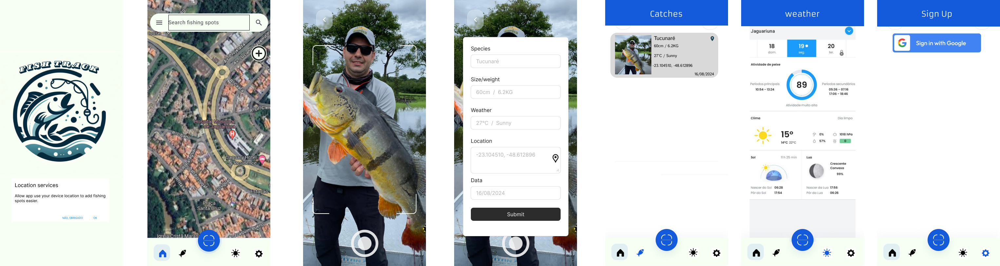

# Fish Track

Fish Track é o aplicativo ideal para os amantes da pesca que desejam registrar e acompanhar suas capturas de forma prática e organizada. Com o Fish Track, você pode facilmente tirar fotos dos peixes que capturou e registrar detalhes importantes como a data, peso, tamanho e local da pesca.

Além de ser uma ferramenta útil para manter um histórico completo das suas capturas, o Fish Track permite que você compartilhe suas conquistas com amigos e outros pescadores, tornando a experiência de pesca ainda mais divertida e social. O aplicativo é intuitivo e fácil de usar, oferecendo um jeito eficiente de acompanhar seu progresso e melhorar suas habilidades de pesca.

- ## Wireframes

## Protótipo

O protótipo do projeto pode ser visualizado neste link do [Figma](https://www.figma.com/proto/Us86zC5GGhTo0VXWMOWr3h/fishtrack?node-id=0-1&t=2L0C0ci8BKmfntIp-1).

